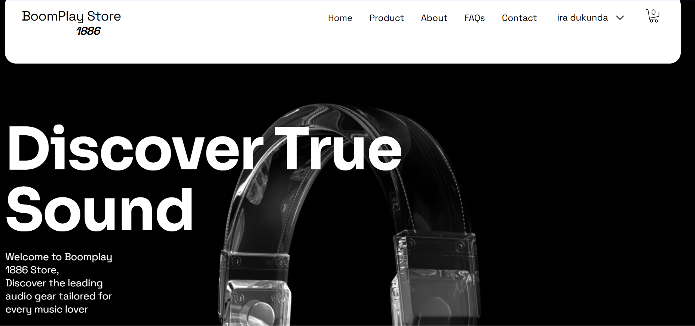
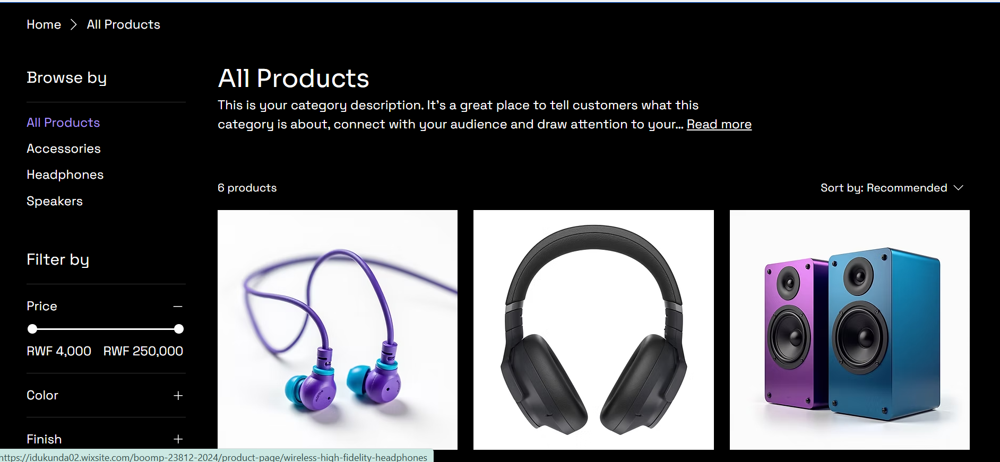
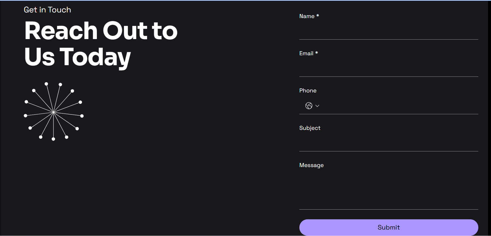
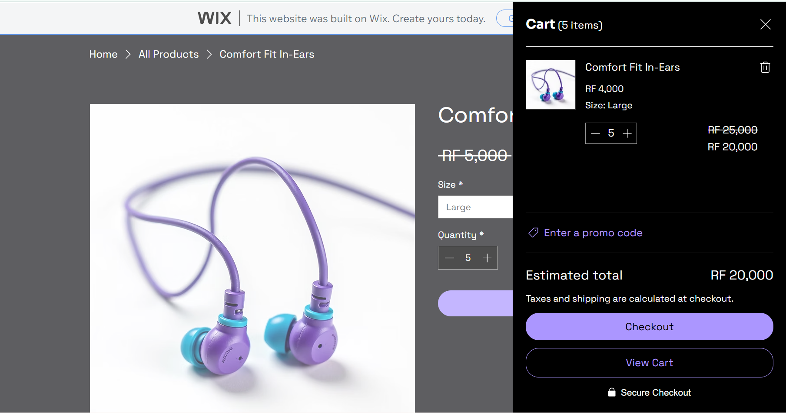

# BoomPlay-Store-1886

 👤 Student Information
* **Name:** Patrick IRADUKUNDA || **23812/2024**
* **Name:** Pacifique CYUZUZO || **24004/2024**
* **Group:** [Day]
* **Campus:** Kigali Campus
* **Institution:** University of Lay Adventists of Kigali (UNILAK)
* **Course:** E-Commerce And Web Application (EWA408510)
* **Lecturer:** Eric Maniraguha

---

## 🏪 Project Overview
* **Project Title:** BoomPlayStore - Premium Audio & Headphone E-Shop
* **Platform Used:** Wix
* **Live Website Link:** https://idukunda02.wixsite.com/boomp-23812-2024
* **GitHub Repository Link:** https://github.com/YN-web/BoomPlay-Store-1886.git

### Description
BoomPlay Store is an elegant, modern e-commerce platform built using low-code/no-code technology. It is specifically designed to showcase and retail premium audio gear, including high-fidelity wireless headphones and comfort-fit earbuds, providing an intuitive consumer shopping experience.

---

## ✨ Features Implemented

* **Homepage:** Features a clean, dark-themed aesthetic that highlights premium audio products with clear "Shop Now" call-to-action triggers.
* **Product Page:** Displays a structured catalog featuring more than 5 distinct audio products with high-resolution imagery, pricing structures, and detailed item descriptions.
* **About Section:** Explains BoomPlay's commitment to delivering top-tier sound experiences and pristine audio engineering to daily listeners.
* **Contact Page:** Features an integrated contact form alongside placeholder operational details to capture customer inquiries seamlessly.
* **Cart Interaction:** A fully integrated functional shopping cart layout allowing users to click "Add to Cart" and dynamically view their items before a simulated checkout.

---

## 📸 Interface Screenshots

### 1. Homepage

### 2. Product Catalog Page

### 3. Contact View

### 4. Cart  Page

---

---

## 🚀 Challenges & Lessons Learned

### Challenges Faced
1. **Layout Adaptability:** Adjusting the predefined Wix layouts to perfectly suit a sleek, dark-themed multimedia store aesthetic required custom component alignments.
2. **Asset Management:** Ensuring product images were high-quality while staying lightweight enough to maintain snappy page-loading speeds.

### Lessons Learned
1. **The Efficiency of No-Code:** Utilizing platforms like Wix dramatically reduces time-to-market execution, making it a powerful skill for rapid commercial prototyping.
2. **User Experience Continuity:** Designing smooth navigation transitions from a homepage teaser straight into a functional cart menu drastically improves overall consumer engagement.
